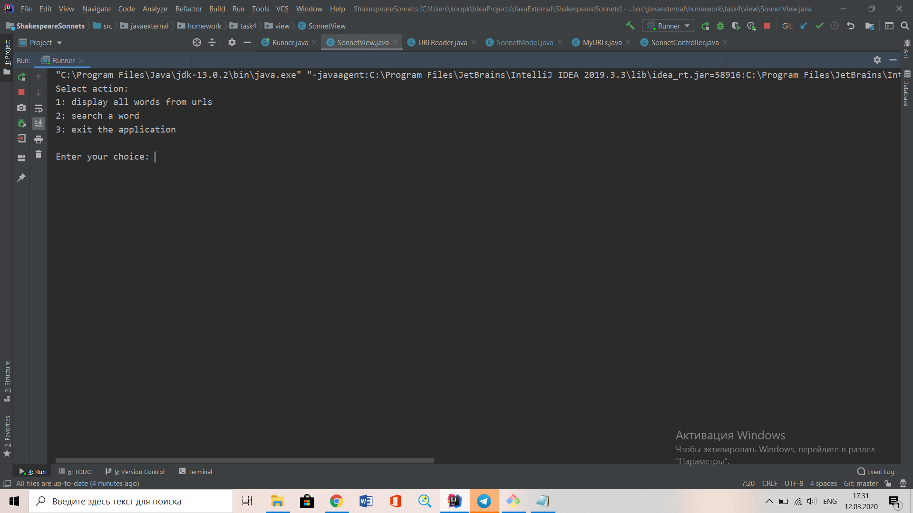
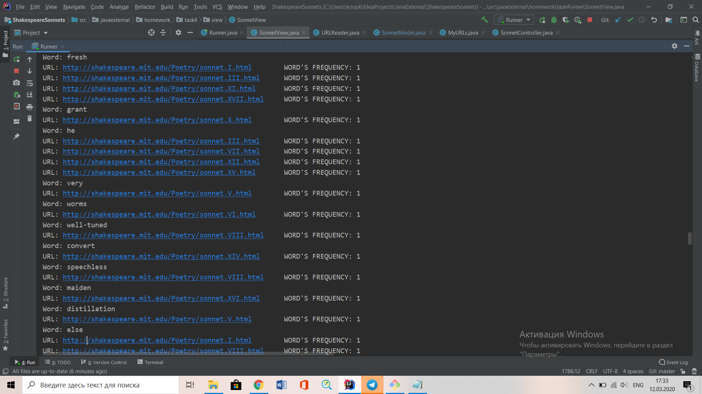
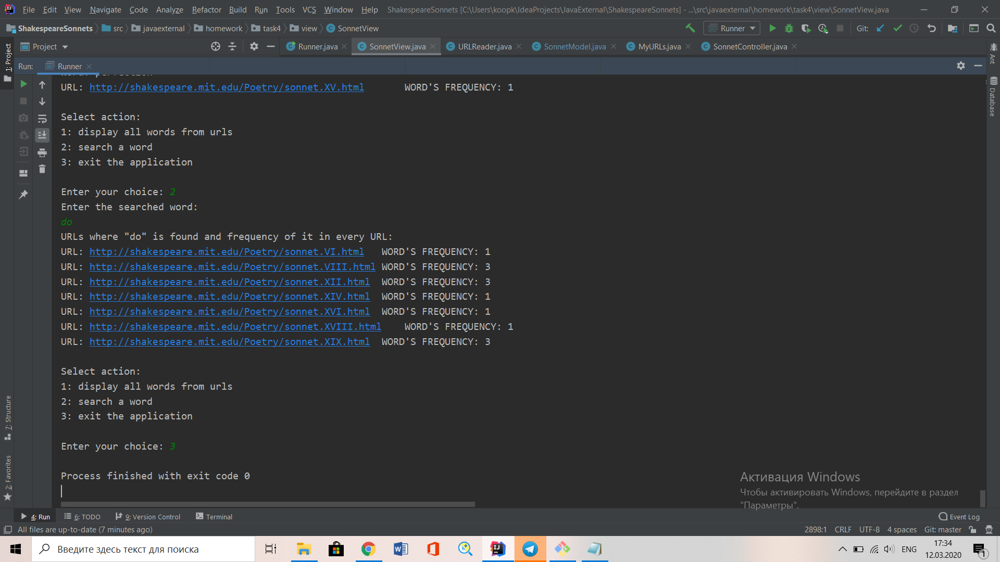

# Search Service "Shakespeare sonnets"
> The task of this program is url processing and searching words in them.
> The program gets some urls(in my case websites with Shakespeare's sonnets)
> After url processing user can choose some options:
> - display all uniq words from all websites and get urls where this word was found 
>   and its frequency in every url;
> - search a word and get additional info about it(urls and frequency);
> - exit the application;

## Table of contents
* [General info](#general-info)
* [Screenshots](#screenshots)
* [Contact](#contact)

## General info
The main purpose of the project was learning Java Maps and working with network.

## Screenshots

## Contact
Created by [@Kateryna Koop](https://github.com/katerynakoop)